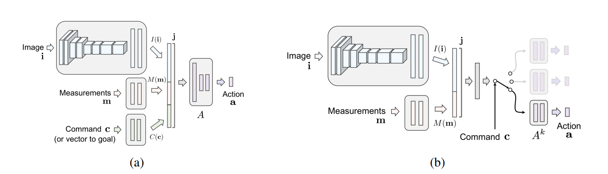

# Conditional Imitation Learning Agents

I will implement interesting Conditional Imitation Learning agents for CARLA starting with a simple implementation of the paper [End-to-end Driving via Conditional Imitation Learning](https://arxiv.org/pdf/1710.02410.pdf).

# Network Architecture

The authors tried two different architectures in the paper.



Both versions are supported here. The left architecture is simply called `Network`, the other one `BranchedNetwork`. You should specify the architecture in your `config.py` because the dataset class is a bit different.

# Dataset

[Here](https://github.com/carla-simulator/imitation-learning) you can find detailed information on the dataset used for training the agent.

To extract the images and targets from the h5 files you can use the following script:

```
python utils/h5_to_imgs.py /path/to/dataset
```

This creates `images` and `targets` folders in `SeqTrain` and `SeqVal` and extracts everything.


# Training


# References

* [End-to-end Driving via Conditional Imitation Learning](https://arxiv.org/pdf/1710.02410.pdf)
* [CARLA](https://carla.org/)

# TODOs

* figure out what to do with command 0
* visualization helpers
* lr-scheduler
* fp16 training
* multi-gpu support (I have only one, so priority is pretty low)
* let the model drive in carla
* evaluation of driving performance??
